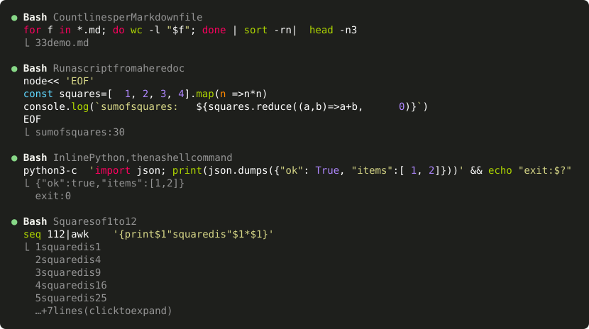

# shell-highlight

A [Claude Code](https://code.claude.com) mod that draws `Bash` and `PowerShell` tool calls with syntax-highlighted commands.



Claude Code prints a shell command in one colour and folds a run of them into a count line (`Ran 4 shell commands`). This mod draws each call as its command, coloured by Claude Code's own highlighter, with the first lines of its output underneath.

## Features

- **Highlighted commands.** `Bash` calls are coloured as bash, `PowerShell` calls as PowerShell.
- **Embedded languages.** A script handed to an interpreter is coloured in its own language, whether it sits in a heredoc, a PowerShell here-string or a quoted argument:

  | Written as | Coloured as |
  | --- | --- |
  | `node -e '…'`, `node <<'EOF'`, `bun`, `deno`, `tsx` | JavaScript / TypeScript |
  | `python -c '…'`, `python3 <<'EOF'`, `py` | Python |
  | `ruby -e`, `perl -e`, `php -r` | Ruby, Perl, PHP |
  | `psql`, `sqlite3`, `mysql` with a heredoc | SQL |
  | `bash -c '…'`, `sh -c`, `zsh -ic '…'` | bash |
  | `pwsh -Command '…'`, `powershell -c` | PowerShell |
  | `cmd /c "…"` | batch |
  | `cat > script.py <<'EOF'`, `@'…'@ \| Set-Content data.json` | by the file's extension |

- **Folded by default, one click to unfold.** A call shows up to 10 lines of its command and 5 lines of its output, then `… +N lines (click to expand)`. A click anywhere on the run of calls unfolds every command and every line of output; a second click folds them again.
- **Hover per call.** The pointer lights up the description and output of the call under it, not the whole run.
- **Wrapping that keeps the colours.** An inline script wider than the terminal is wrapped at a space outside string literals, so every wrapped line is still highlighted. Wide characters (CJK, emoji) count as two cells.
- **Status at a glance.** The dot is dim while a call runs, green when it succeeded, red when it failed or was interrupted. A running call says `Running…`, an interrupted one `Interrupted`, a silent one `(no output)`.
- **Clean output.** Colour codes and control characters are removed from the output; in a command they are shown as visible symbols (`␛`).
- **Everything else stays native.** Other tools keep Claude Code's rows. A run that mixes shell calls with other tools keeps its count line (`Read 1 file, ran 2 shell commands`) above the shell calls and unfolds into the engine's own rows.

### Where the output comes from

| View | Command | Output |
| --- | --- | --- |
| Fullscreen transcript, folded | this mod | this mod, 5 lines |
| Fullscreen transcript, unfolded by a click | this mod | this mod, all lines |
| Detailed transcript (`ctrl+o`) | this mod | Claude Code, all lines (this mod for a run unfolded before) |
| Classic (non-fullscreen) transcript | this mod | Claude Code, folded, `ctrl+o to expand` |

The fold belongs to Claude Code: a click unfolds the run of consecutive calls it sits in, and the state lasts as long as Claude Code keeps it.

## Requirements

Claude Code **2.1.287 or newer**, the first version with mods (function hooks). The mods API is early access and may change between releases.

## Install

```sh
git clone https://github.com/Turbo-Thorschten/shell-highlight.git
claude --plugin-dir ./shell-highlight
```

To load it in every session, name the folder in `CLAUDE_CODE_PLUGIN_DIRS`, either in your environment or in the `env` block of `~/.claude/settings.json`:

```json
{
  "env": {
    "CLAUDE_CODE_PLUGIN_DIRS": "~/path/to/shell-highlight"
  }
}
```

The variable is a list. To keep other mods, append the folder with your platform's path-list separator: `;` on Windows, `:` on Linux and macOS.

Open `/plugin` to check: the header reads `N mods active · shell-highlight, …`.

## How it works

Two files: [`hooks/text.ts`](hooks/text.ts) splits a command into pieces and their languages, and [`hooks/register.ts`](hooks/register.ts) draws them from three `ui.render` hooks.

1. **`ToolGroup`**, a run of calls. Folded, the hook draws each shell call itself. Unfolded, it hands the run to Claude Code, which draws every call as a row.
2. **`ToolUse`**, one row. For a shell call the hook draws the highlighted command. A row of an unfolded run also draws its output, because Claude Code draws none there.
3. **`ToolResult`**, the result block under a row. Left to Claude Code, except where the row already drew the output.

The mod changes how rows are drawn and nothing else: the command that runs, its permission prompt and its result are untouched. It keeps no state, reads no files, starts no processes and makes no network calls. `claude plugin validate` reports one engine call, `$.ui.resolve`.

It runs next to other mods. For a shell row it returns its own drawing, so a mod loaded beneath it does not draw that row.

## Tested

Every behaviour above was checked on a real screen, on Claude Code 2.1.287:

- Windows 11 in WezTerm, `Bash` and `PowerShell` tools
- Linux (Ubuntu under WSL 2) in tmux, fullscreen and classic mode, at 110 and 50 columns
- pointer hover and clicks, the `ctrl+o` transcript, a running, a failed, an interrupted and a not yet approved call, 3,000 lines of output, a second mod loaded alongside

`claude plugin test` runs 57 tests of the splitting, wrapping and drawing on the terminal and desktop surfaces.

## Development

```sh
claude plugin validate .    # what the module hooks and calls, and anything the engine would refuse
claude plugin test .        # runs tests/*.test.ts
npx -p typescript tsc -p .  # type-check; needs .claude-plugin/types/, which Claude Code writes when it loads the mod
```

## License

[MIT](LICENSE)
